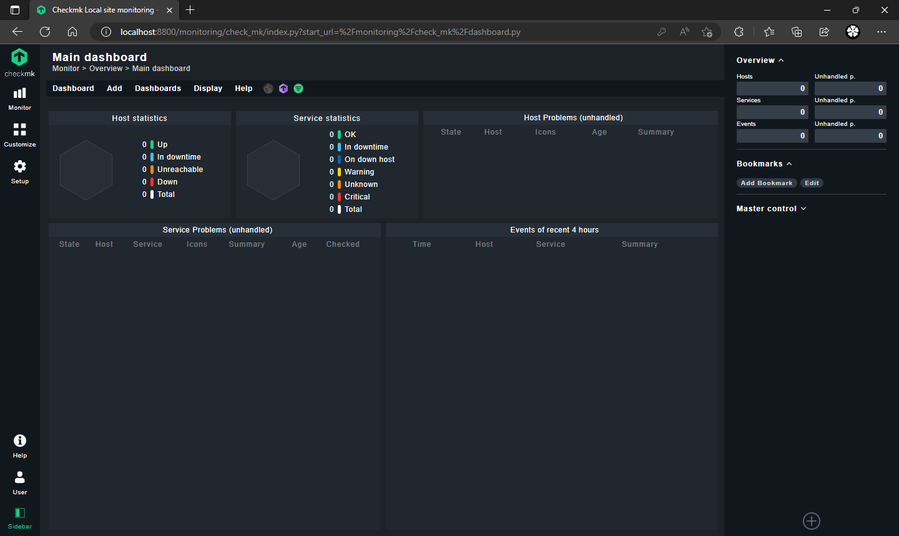

Sebelum memulai pastikan docker sudah terinstall di server, untuk memastikan bisa menggunakan command `docker --version`, jika sudah keluar output seperti di bawah berarti docker sudah terinstall.


untuk menjalankan container checkmk ada 2 cara
* [docker run](https://)
* [docker-compose](https://)

## Docker Run
```bash
docker container run -it \
--name checkmk-server --restart always \
-p 5000:5000 -p 6557:6557 \
--tmpfs /opt/omd/sites/checkmk/tmp:uid=1000,gid=1000 \
-v checkmk-volume:/omd/sites -v /etc/localtime:/etc/localtime:ro \
-e CMK_SITE_ID=checkmk \
-d checkmk/check-mk-raw:2.0.0-latest
```
## Docker Compose

nano docker-compose.yml

```docker-compose.yml
version: '3.7'
services:
  checkmk-server:
    container_name: checkmk-server
    image: checkmk/check-mk-raw:2.0.0-latest
    restart: always
    tmpfs:
      - /opt/omd/sites/checkmk/tmp:uid=1000,gid=1000
    ulimits:
      nofile: 1024
    volumes:
      - '/etc/localtime:/etc/localtime:ro'
      - 'checkmk-volume:/omd/sites'
    ports:
      - '8800:5000'
      - '6557:6557'
    environment:
      - CMK_SITE_ID=checkmk
volumes:
  checkmk-volume:
    name: checkmk-volume
```

Save and Close

lalu jalankan dengan command `docker-compose up -d` atau `docker compose up -d` jika sudah menggukanan Docker Version 2.0


kedua metode di atas juga dapat di jalankan dengan argument `-H ssh://USER@IPSERVER:PORT` untuk menjalankan container tanpa harus SSH terlebih dahulu kedalam server.

## Login Checkmk Server
setelah berhasil di jalankan menggunakan method ke-1 ataupun yang ke-2, sekarang tiba saatnya untuk testing menggunakan browser.

sebelum itu kita perlu menjalankan perintah `docker logs checkmk-server` untuk mengetahui default password dari user `cmkadmin`, pada contoh dibawah terlihat password default user `cmkadmin` adalah `EVtsZDQ7`, untuk mengganti password default bisa menggunakan perintah `docker exec -it checkmk-server omd su checkmk` lalu `htpasswd etc/htpasswd cmkadmin`, masukan password baru dan ulangi kembali


sebagai contoh kali ini saya menggunakan `WSL` di local device, jadi saya akan akses dengan url `http://localhost:8800` 


lalu masukan user password dan klik login



Selesai, sekian terimakasih